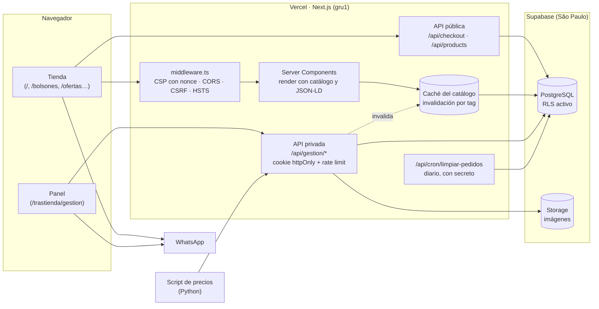
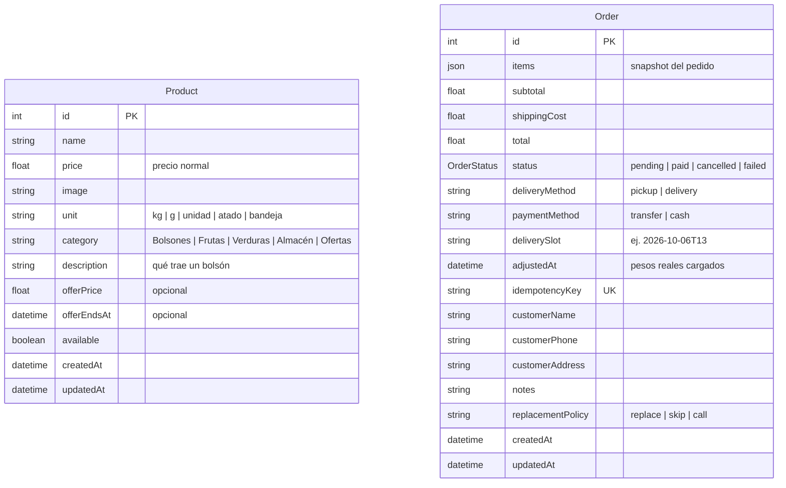

# El Pampa — Tienda online para una verdulería de barrio


**Sitio en producción:** [elpampa.vercel.app](https://elpampa.vercel.app)

Tienda online y panel de administración para **El Pampa**, una verdulería y frutería
real de Barrio General Paz, Córdoba (Argentina). Los clientes arman el pedido desde el
celular —por kilo, gramo, unidad, atado o bandeja—, eligen retiro en el local o envío
en un turno, y pagan por transferencia o en efectivo. El dueño pesa, ajusta el pedido
con los pesos reales y le manda al cliente el total final por WhatsApp desde un panel
propio.

No es una maqueta: está en uso, con clientes y pedidos reales. Eso condicionó casi
todas las decisiones técnicas, y el foco de este README está justamente ahí: **qué
problema había y por qué se resolvió de esa forma**.

---

## Índice

- [El problema](#el-problema)
- [Funcionalidades](#funcionalidades)
- [Stack](#stack)
- [Arquitectura](#arquitectura)
- [Decisiones técnicas destacadas](#decisiones-técnicas-destacadas)
- [Modelo de datos](#modelo-de-datos)
- [API](#api)
- [Estructura del proyecto](#estructura-del-proyecto)
- [Correr el proyecto localmente](#correr-el-proyecto-localmente)
- [Tests y CI](#tests-y-ci)
- [Variables de entorno](#variables-de-entorno)
- [Deploy](#deploy)
- [Script de actualización de precios](#script-de-actualización-de-precios)
- [Limitaciones conocidas y próximos pasos](#limitaciones-conocidas-y-próximos-pasos)

---

## El problema

La verdulería tomaba pedidos solo por WhatsApp. Eso significaba:

- Mandar la lista de precios a mano cada vez que alguien preguntaba.
- Ir y volver con cada cliente para confirmar cantidades ("¿medio kilo o uno?").
- Calcular el total a mano, con errores.
- No tener registro de qué se vendió cada día.

Además, el rubro tiene un problema propio: **el peso real cambia el total**. Nadie
pesa exactamente 1,5 kg de tomate, así que cobrar online por adelantado obliga a
devolver diferencias.

El objetivo fue que el cliente pueda **armar y enviar el pedido solo**, con precios
actualizados y el total calculado, y que el dueño tenga **un lugar donde ver, ajustar y
confirmar los pedidos** sin cambiar su forma de trabajar: el pedido sigue cerrándose
por WhatsApp, pero llega completo, y el cobro se hace sobre el peso real.

Antes de esta versión se relevaron 50 verdulerías con venta online en Córdoba y del
resto del país. El modelo que domina es "catálogo + carrito + cierre por WhatsApp", con
cobro al entregar o después de armar el pedido, entregas por turnos y pedido mínimo.
Con eso en mente se sacó Mercado Pago y se sumaron turnos, envío fijo, bolsones y ofertas.

---

## Funcionalidades

### Para el cliente

- **Catálogo con búsqueda y filtros** (Bolsones, Frutas, Verduras, Almacén, Ofertas) y
  páginas propias por categoría: [`/bolsones`](https://elpampa.vercel.app/bolsones),
  [`/ofertas`](https://elpampa.vercel.app/ofertas), `/frutas`, `/verduras` y una
  página de [`/envios`](https://elpampa.vercel.app/envios).
- **Bolsones destacados** con la lista de lo que traen, y una sugerencia en el carrito
  si todavía no sumaste uno.
- **Ofertas** con precio tachado, porcentaje de descuento y fecha de vencimiento: vencen
  solas, sin que el dueño tenga que acordarse de sacarlas.
- **Cantidades por unidad de venta**: `kg`, `g`, `unidad`, `atado` o `bandeja`, con
  pasos adecuados y precisión de 50 g para lo que va por peso. En el carrito, lo que va
  por peso se puede ver en kilos o en gramos.
- **Condiciones a la vista** antes de comprar: retiro gratis, envío de $4.000 (gratis
  desde $20.000), pedido mínimo para envío, turnos y "próxima entrega: hoy de 19 a 20 h".
- **Carrito persistente**: sobrevive a cerrar la pestaña, y hay un botón de **repetir
  el último pedido** (la compra en verdulería es semanal).
- **Checkout en dos pasos sin cuenta**: datos de contacto con validación en vivo,
  retiro o envío con **turno de entrega** (13 a 14 h o 19 a 20 h), transferencia o
  efectivo, qué hacer si falta un producto y aclaraciones.
- **Total aproximado y total final**: si hay productos por peso, el carrito avisa que el
  total es aproximado y que el local confirma el exacto por WhatsApp después de pesar.
- **Sin sorpresas de precio**: si el dueño cambió un precio o algo se quedó sin stock
  mientras el cliente armaba el carrito, el pedido no se registra; el carrito se
  actualiza y le muestra qué cambió.
- **Mensaje de WhatsApp armado** con el detalle del pedido, la entrega y el pago.
- Estado del local en vivo, mapa, preguntas frecuentes, términos y privacidad.

### Para el dueño (panel de administración)

- Alta, edición y baja de productos, con **ofertas con vencimiento**, descripción para
  los bolsones y **subida de imágenes comprimidas a WebP en el navegador**.
- **Botón de "sin stock" de un toque**, sin entrar a editar el producto.
- **Pedidos del día agrupados por turno** (envíos de 13 a 14 h, de 19 a 20 h, retiros),
  con los datos del cliente, el medio de pago y un link directo a su WhatsApp.
- **Ajuste de pesos reales**: se cargan las cantidades pesadas, se recalcula el total
  con el precio guardado del pedido y queda marcado como "total final".
- **"Avisar total final"** y **"Pedir reseña"** con mensajes de WhatsApp ya redactados.
- Resumen del día: cobrado, por cobrar y envíos por turno.
- **Script de precios** que cruza la lista del Mercado de Abasto con el catálogo y
  actualiza todo junto (ver [abajo](#script-de-actualización-de-precios)).

---

## Stack

| Capa | Tecnología | Por qué |
|---|---|---|
| Framework | **Next.js 15** (App Router) + **React 19** | Frontend y API en un solo proyecto desplegable en Vercel, sin servidor aparte. |
| Lenguaje | **TypeScript** | Tipos compartidos entre API y componentes (`src/lib/types.ts`). |
| Base de datos | **PostgreSQL** en Supabase (São Paulo) | Postgres administrado, en la misma región que las funciones (`gru1`). |
| ORM | **Prisma 6** | Migraciones versionadas y consultas parametrizadas por defecto. |
| Archivos | **Supabase Storage** | Imágenes de productos, accedido por su API REST directamente. |
| Auth | **JWT** en cookie `httpOnly` | Un único administrador: no justificaba un proveedor de identidad. |
| Estilos | **CSS plano** con custom properties | Paleta temática, sin framework CSS. Fuentes con `next/font`, íconos SVG con `lucide-react`. |
| Tests | **Vitest** (unitarios + integración contra Postgres real) | Lo que cuesta plata (totales, ofertas, turnos, permisos) tiene test. |
| CI | **GitHub Actions** | Typecheck, lint, tests, build, auditoría de dependencias y chequeo de secretos en el bundle. |
| Herramientas | **Python + pandas** | Script de actualización masiva de precios desde el Excel del mayorista. |
| Hosting | **Vercel** + Vercel Analytics | Deploy automático en cada push, cron diario de limpieza. |

---

## Arquitectura



**Una sola aplicación, dos superficies.** La tienda (`storefront-page.tsx` y
`components/storefront/`) y el panel (`admin-panel-page.tsx` y `components/admin/`)
son componentes cliente que usan `fetch` contra los route handlers de Next. No hay
servidor Express, ni librería de estado global, ni librería de data fetching: para el
tamaño del proyecto no aportaban nada que justificara la dependencia.

Las páginas públicas son **Server Components** que leen el catálogo y se lo pasan a la
tienda como estado inicial, junto con los datos del local: el HTML ya llega completo y
el navegador no hace pedidos extra al cargar.

**La lógica que importa es pura y compartida.** Precios, ofertas, envío y turnos viven
en `src/lib/pricing.ts` y `src/lib/delivery-slots.ts`, sin acceso a la base ni al reloj
global. El carrito los usa para mostrar el total al instante y el checkout los vuelve a
correr en el servidor con los precios de la base: **lo que diga el navegador nunca
define cuánto se cobra**.

---

## Decisiones técnicas destacadas

### 1. Peso variable: total estimado y total final

**Problema:** en lo que va por peso, el total real se conoce recién al pesar. Cobrar
online por adelantado obliga a devolver diferencias, y casi ninguna verdulería de
Córdoba lo hace.

**Solución:**

- El pedido se registra con un **total estimado** y el carrito lo dice explícitamente.
- En el panel, el dueño carga los pesos reales. El total se recalcula con el **precio
  guardado en el pedido** (no el del catálogo, que puede haber cambiado) y se conserva
  el costo de envío original. El ajuste es condicional por `updatedAt`: si el pedido
  cambió en otra pestaña, no se pisa.
- Un botón arma el mensaje de WhatsApp con el **total final**, el alias para
  transferir o el aviso de pago en efectivo, y el turno de entrega.
- Si el pedido no tiene nada por peso, el total es exacto desde el principio.

### 2. Precios del servidor y detección de cambios

**Problema:** con la inflación, los precios cambian seguido. Un cliente puede tener el
carrito armado desde hace una hora con precios viejos.

**Solución:** el carrito manda el precio que vio en cada línea. El servidor arma las
líneas con los precios vigentes (oferta incluida) y, si alguno no coincide, **responde
409 sin registrar nada**. El carrito se actualiza con los precios nuevos y le muestra al
cliente "Tomate: antes $ 800, ahora $ 900" para que confirme de nuevo. Lo mismo pasa si
algo se quedó sin stock. El carrito se siente instantáneo, pero la fuente de verdad del
precio es siempre la base.

### 3. Checkout idempotente

**Problema:** en el celular, con una conexión lenta, tocar "Confirmar" dos veces
generaba dos pedidos.

**Solución, en tres barreras:**

1. El botón se deshabilita mientras el pedido está en curso.
2. El navegador genera una **clave de idempotencia** (UUID) por intento de compra. Se
   mantiene si el cliente reintenta y se renueva cuando cambia el carrito o el pedido se
   registra bien.
3. La columna `idempotencyKey` tiene **índice único**. Si dos requests con la misma
   clave llegan a la vez, la base rechaza el segundo insert (`P2002`) y el handler
   devuelve el pedido que ya se había creado.

Un reintento devuelve el mismo pedido **aunque el precio haya cambiado en el medio**
(la idempotencia se resuelve antes que la validación de precios). Hay un test de
integración con 6 requests simultáneos con la misma clave: un único pedido.

### 4. Seguridad por capas

El sitio maneja pedidos con nombre, teléfono y dirección de clientes reales. Se hicieron
dos auditorías ofensivas con verificación independiente de cada hallazgo; en la última
**no aparecieron hallazgos críticos ni altos**, y los de severidad media y baja se
corrigieron.

**La base de datos estaba abierta.** Supabase expone las tablas de `public` por una API
REST con el rol `anon`, cuya clave es pública por diseño. Ese rol tenía todos los
permisos y la tabla de productos no tenía RLS: con esa clave se podía borrar el
catálogo. La migración [`enable_row_level_security`](prisma/migrations/20260811050000_enable_row_level_security/migration.sql)
activa RLS sin políticas (denegar por defecto) y revoca los permisos; otra cierra la
ejecución de funciones. Un **test de integración falla si alguna tabla queda sin RLS o
con permisos para la API pública**, así una tabla nueva no puede nacer expuesta.

| Capa | Implementación |
|---|---|
| **Sesión del panel** | JWT `HS256` en una cookie `httpOnly`, `Secure`, `SameSite=Strict`, limitada a `/api/gestion`. Ningún JavaScript la puede leer. Revocación global con `ADMIN_TOKEN_VERSION`. Se rechazan los secretos de ejemplo de `.env.example`. |
| **CSRF** | `SameSite=Strict`, control de `Origin` y rechazo de mutaciones con `Sec-Fetch-Site` distinto de `same-origin`. |
| **CSP** | `script-src` con **nonce por request** y `strict-dynamic`. Sin CDNs externos: fuentes con `next/font` e íconos en SVG. HSTS, `nosniff`, `frame-ancestors 'none'`. |
| **Rate limiting** | Por tipo de endpoint (login 8 / 10 min, checkout, lecturas, escrituras, subidas), con IPv6 agrupado por /64. |
| **Validación** | Manual y centralizada ([`validation.ts`](src/lib/validation.ts)): ids estrictos dentro del rango de la base, números sin hexadecimal ni exponentes, precios mayores a 0, fechas reales, textos sin caracteres de control, invisibles ni aislamientos bidi. Solo los errores de validación llegan al cliente; los de Prisma quedan en el log. |
| **Inyección SQL** | No hay SQL armado a mano en la app: todo pasa por Prisma, que parametriza. |
| **Uploads** | Solo WebP/JPG/PNG hasta 5 MB, validados por **magic bytes** (no por lo que declara el navegador), con nombre generado en el servidor. |
| **XSS** | React escapa todo; el JSON-LD se serializa escapando `<`, `>` y `&`. Los mensajes de WhatsApp que manda el local no copian texto libre del cliente. |
| **Secretos** | Ninguna variable es `NEXT_PUBLIC_`; los módulos de servidor importan `server-only`, y la CI verifica que ningún nombre ni valor de variable sensible aparezca en el JavaScript del navegador. |
| **Dependencias** | `npm audit` de producción sin vulnerabilidades (se corrigió una RCE crítica de Next). |
| **Auditoría** | Eventos sospechosos (logins fallidos, rate limits, tokens inválidos, orígenes bloqueados) se registran como JSON con la clave `secEvent`. Nunca se loguean contraseñas, tokens ni lo que se tipea en el login. |

### 5. Caché del catálogo con invalidación inmediata

**Problema:** cada visita consultaba el catálogo a la base antes de mostrar nada (la
página se renderiza por request porque lo exige la CSP con nonce).

**Solución:** la lectura del catálogo se cachea con `unstable_cache` y un tag. Cada
acción del panel que modifica productos invalida ese tag, así que **un cambio de precio
o de stock se ve al instante**. Las ofertas que vencen no necesitan invalidación: el
precio efectivo se calcula al leer, con la hora actual. Además, las funciones corren en
São Paulo (`gru1`), en la misma región que la base.

### 6. Turnos y horarios con una sola fuente de verdad

Los horarios del local estaban en tres lugares (texto en variables de entorno, las
ventanas del "abierto ahora" y el JSON-LD) y podían contradecirse. Ahora todo se deriva
de [`store-hours.ts`](src/lib/store-hours.ts): el texto que se muestra, los datos
estructurados y los **turnos de entrega**. Un turno se ofrece solo si cae dentro del
horario del local ese día (el domingo, que cierra a las 14, solo aparece el de 13 a 14)
y si falta al menos una hora para que empiece. El servidor recalcula los turnos al
recibir el pedido: un turno vencido o inventado se rechaza.

### 7. SEO local y descubribilidad por asistentes de IA

- Las páginas son **Server Components**: el HTML incluye el catálogo completo.
- **Datos estructurados JSON-LD**: `GroceryStore` con dirección, coordenadas y horarios;
  cada producto como `Offer` con disponibilidad (`InStock`/`OutOfStock`), vencimiento de
  la oferta y **precio por unidad** (`UnitPriceSpecification` con `KGM`, `GRM` o `C62`);
  `FAQPage` y `BreadcrumbList`.
- Páginas propias para bolsones, ofertas, frutas, verduras y envíos, cada una con texto
  útil y metadata propia; sitemap con la fecha real de modificación de los productos.
- **[`/llms.txt`](https://elpampa.vercel.app/llms.txt)**: resumen del negocio en texto
  plano para modelos de lenguaje, generado a partir de los datos reales.

### 8. Pensado para el celular

- Áreas táctiles de 44×44 px, validación inline sin librerías, foco en el primer error.
- Sin Font Awesome por CDN ni `@import` de Google Fonts: menos peso y sin bloquear el
  render.
- Tarjetas de producto memoizadas: cambiar el carrito no re-renderiza toda la grilla.
- Las animaciones respetan `prefers-reduced-motion`.

### 9. Rutas privadas no predecibles

El panel vive en `/trastienda` en lugar de `/admin` o `/login`, y no figura en
`robots.txt`. **No se presenta como medida de seguridad** —cualquiera puede verlo en el
JavaScript—, sino como forma de quedar fuera del barrido automático de bots.

---

## Modelo de datos



`Order.items` es un **snapshot en JSON** de los productos al momento de la compra, no
una relación con `Product`. Es intencional: si mañana cambia el precio del tomate o se
borra un producto, los pedidos históricos siguen mostrando lo que realmente se vendió y
a qué precio, y el ajuste de pesos usa ese precio. Listar pedidos no requiere consultas
por ítem (no hay N+1) y el checkout resuelve todo el carrito en una sola consulta con
`WHERE id IN (...)`.

El estado del pedido es un **enum de Postgres**: la base rechaza cualquier valor que no
sea uno de los cuatro. Las migraciones están versionadas en
[`prisma/migrations`](prisma/migrations) y explican el porqué de cada cambio.

---

## API

### Pública

| Método | Ruta | Descripción |
|---|---|---|
| `GET` | `/api/products` | Catálogo (cacheado). Disponibles primero, luego alfabético. |
| `GET` | `/api/store-info` | Datos públicos del local: horarios, envío, alias. |
| `POST` | `/api/checkout` | Registra el pedido. Idempotente. 409 si cambió un precio o algo está sin stock; 400 si el turno ya no está disponible. |

### Privada (cookie de sesión `httpOnly`)

| Método | Ruta | Descripción |
|---|---|---|
| `POST` | `/api/gestion/login` | Inicia sesión: setea la cookie por 12 h. |
| `POST` | `/api/gestion/logout` | Borra la cookie. |
| `GET` | `/api/gestion/session` | ¿La sesión sigue vigente? |
| `POST` | `/api/gestion/products` | Crea un producto (con oferta y descripción opcionales). |
| `PUT` / `DELETE` | `/api/gestion/products/:id` | Edita o elimina un producto. |
| `PUT` | `/api/gestion/products/:id/availability` | Marca un producto como disponible o sin stock. |
| `POST` | `/api/gestion/products/bulk` | Actualización masiva de precios, stock y ofertas (hasta 500, todo o nada). |
| `POST` | `/api/gestion/upload-product-image` | Sube una imagen a Supabase Storage. |
| `GET` | `/api/gestion/orders?date=YYYY-MM-DD` | Pedidos de un día (creados ese día o con turno ese día). |
| `PUT` / `DELETE` | `/api/gestion/orders/:id` | Ajusta los pesos reales / elimina un pedido. |
| `PUT` | `/api/gestion/orders/:id/confirm` | Marca un pedido como pagado. |
| `PUT` | `/api/gestion/orders/:id/cancel` | Cancela un pedido. |

### Cron

| Método | Ruta | Descripción |
|---|---|---|
| `GET` | `/api/cron/limpiar-pedidos` | Diario (Vercel Cron, `Authorization: Bearer CRON_SECRET`). Cancela pendientes de más de 7 días y borra cancelados de más de 90. Nunca toca pedidos pagados. |

Todos los endpoints privados siguen el mismo patrón: verificación de sesión, rate
limit, validación del cuerpo y `try/catch` con log del error y respuesta genérica.

---

## Estructura del proyecto

```
src/
├── app/
│   ├── page.tsx                  # Home (Server Component)
│   ├── bolsones/ ofertas/ frutas/ verduras/   # Páginas de categoría
│   ├── envios/                   # Zonas, turnos, costos y medios de pago
│   ├── layout.tsx                # Metadata global y fuentes (next/font)
│   ├── globals.css               # Estilos (paleta con custom properties)
│   ├── trastienda/               # Ingreso y panel de administración
│   ├── api/
│   │   ├── products/  store-info/  checkout/
│   │   ├── cron/limpiar-pedidos/
│   │   └── gestion/              # API privada del panel
│   ├── llms.txt/  robots.ts  sitemap.ts  opengraph-image.tsx
│   └── terminos/  privacidad/  not-found.tsx
├── components/
│   ├── storefront-page.tsx       # Tienda (orquestador)
│   ├── storefront/               # Carrito, checkout, tarjetas, hooks
│   ├── admin-panel-page.tsx      # Panel (orquestador)
│   ├── admin/                    # Productos, pedidos, ajuste de pesos, mensajes
│   ├── category-landing.tsx  info-section.tsx  brand-icons.tsx
│   └── login-page.tsx
├── lib/
│   ├── pricing.ts                # Precios, ofertas, envío y totales (puro)
│   ├── delivery-slots.ts         # Turnos de entrega (puro)
│   ├── store-hours.ts            # Horarios: única fuente de verdad
│   ├── product-units.ts          # Unidades, pasos y redondeo de cantidades
│   ├── validation.ts  sanitize.ts  request-body.ts  route-params.ts
│   ├── auth.ts                   # Sesión del panel (cookie + JWT)
│   ├── products.ts               # Catálogo cacheado + invalidación
│   ├── order-lifecycle.ts        # Ajuste de pesos, limpieza, serialización
│   ├── seo.ts                    # JSON-LD
│   ├── rate-limit.ts  security-log.ts  whatsapp.ts  site.ts  types.ts
│   └── …
└── middleware.ts                 # CSP con nonce, CORS, CSRF y cabeceras
prisma/
├── schema.prisma
└── migrations/                   # Migraciones comentadas
tests/integration/                # Tests contra Postgres real
scripts/
├── actualizar_precios.py         # Script de precios (Python + pandas)
├── precios/                      # Ejemplos e instrucciones del script
└── check-client-bundle.mjs       # Verifica que no haya secretos en el bundle
```

---

## Correr el proyecto localmente

**Requisitos:** Node.js 20 o superior y una base PostgreSQL (un proyecto gratuito de
Supabase alcanza).

```bash
git clone <url-del-repositorio>
cd verduleria-web
npm install
cp .env.example .env        # completar con tus valores (ver tabla abajo)
npx prisma migrate deploy   # crea las tablas
node prisma/seed.js         # opcional: carga 3 productos de ejemplo
npm run dev
```

- Tienda: http://localhost:3000
- Panel: http://localhost:3000/trastienda (usuario y contraseña de `ADMIN_USERNAME` / `ADMIN_PASSWORD`)

> **Recomendación:** usá una base de datos separada para desarrollo. Si `.env` apunta a
> la base de producción, cualquier prueba local crea pedidos reales.

---

## Tests y CI

```bash
npm run typecheck          # tsc --noEmit
npm run lint               # ESLint (next/core-web-vitals + next/typescript)
npm test                   # tests unitarios (Vitest)
TEST_DATABASE_URL=postgresql://…/elpampa_test npm run test:integration
npm run build && npm run check:bundle   # ningún secreto en el JavaScript del navegador
python3 -m unittest scripts/test_actualizar_precios.py
```

- **Unitarios** (~360): precios y ofertas, redondeo a centavos, envío y mínimos, turnos
  en los bordes de horario (11:59 / 12:00 / 12:01, domingo, medianoche, cambio de año) y
  con el servidor en otras zonas horarias, validación, sesión, mensajes de WhatsApp, SEO.
- **Integración** (~120): llaman a los route handlers contra un **Postgres real**:
  checkout con todos sus 400/409, idempotencia concurrente, 401 en todos los endpoints
  del panel, ofertas, bulk todo-o-nada, ajuste de pesos con edición concurrente, cron,
  subida de imágenes y permisos de la base para la API pública. La base de test se crea
  y migra sola; los tests se niegan a correr contra una base cuyo nombre no diga "test".
- **CI** ([`.github/workflows/ci.yml`](.github/workflows/ci.yml)): en cada pull request
  y push corre typecheck, lint, tests (también con otra zona horaria), integración con
  Postgres 16, build, chequeo de secretos en el bundle, `npm audit` de producción y los
  tests del script de Python.

---

## Variables de entorno

| Variable | Obligatoria | Descripción |
|---|:---:|---|
| `DATABASE_URL` | Sí | Conexión a Postgres. En Supabase, pooler en modo *transaction* con `pgbouncer=true&connection_limit=1`. |
| `DIRECT_URL` | Sí | Conexión para migraciones. En Supabase, pooler en modo *session*. |
| `ADMIN_USERNAME` / `ADMIN_PASSWORD` | Sí | Credenciales del panel. Contraseña larga (16+ caracteres). |
| `JWT_SECRET` | Sí | Secreto para firmar las sesiones (`openssl rand -base64 48`). |
| `ADMIN_TOKEN_VERSION` | No | Cambiarla y hacer Redeploy cierra todas las sesiones abiertas. |
| `CRON_SECRET` | Sí, para la limpieza | Secreto del cron diario (`openssl rand -base64 48`). |
| `SUPABASE_URL` / `SUPABASE_SERVICE_ROLE_KEY` | Para imágenes | Subida de imágenes a Storage. La service role key nunca sale del servidor. |
| `SUPABASE_STORAGE_BUCKET` | No | Nombre del bucket (por defecto `product-images`). |
| `SITE_URL` | No | URL canónica para metadata, sitemap y orígenes permitidos. |
| `STORE_NAME`, `STORE_ADDRESS`, `STORE_NEIGHBORHOOD` | No | Datos del negocio. Los horarios están en `src/lib/store-hours.ts`. |
| `TRANSFER_ALIAS`, `TRANSFER_CBU`, `WHATSAPP_NUMBER`, `CONTACT_EMAIL` | No | Datos de contacto y para cobrar por transferencia. |
| `DELIVERY_FEE` | No | Costo fijo del envío (por defecto 4000). |
| `DELIVERY_MIN_PURCHASE` | No | Pedido mínimo para envío, sobre los productos (por defecto 10000). |
| `DELIVERY_FREE_THRESHOLD` | No | Desde este monto el envío es gratis (por defecto 20000). |
| `DELIVERY_MAX_WEIGHT_KG` | No | Peso a partir del cual se avisa que el envío puede ir en dos viajes. |
| `INSTAGRAM_URL` | No | Si está vacía, el menú no muestra Instagram. |
| `GOOGLE_REVIEW_URL` | No | Link corto para dejar reseña en Google. Si está vacía, no se pide la reseña. |

Ninguna variable usa el prefijo `NEXT_PUBLIC_`. El `.gitignore` excluye cualquier
`.env*` salvo `.env.example`.

---

## Deploy

El proyecto está desplegado en **Vercel** con deploy automático en cada push a `main`.

1. Importar el repositorio en Vercel (preset **Next.js**, comandos por defecto).
   [`vercel.json`](vercel.json) fija la región de las funciones en `gru1` (São Paulo,
   junto a la base) y programa el cron diario de limpieza.
2. Cargar las variables de entorno de la tabla anterior (incluido `CRON_SECRET`).
3. Aplicar las migraciones contra la base de producción: `npm run prisma:deploy`.
4. Recomendado: en **Vercel → Firewall**, una regla de rate limit para
   `/api/gestion/login` y `/api/checkout`. El limitador del código vive en la memoria de
   cada instancia; la regla del firewall es global.

> El plan **Hobby** de Vercel es para uso personal y no comercial. Para un negocio
> corresponde el plan **Pro**.

### Monitoreo

En **Vercel → Logs**, filtrar por `secEvent` para ver intentos de login fallidos, rate
limits alcanzados y otros eventos de seguridad.

---

## Script de actualización de precios

[`scripts/actualizar_precios.py`](scripts/actualizar_precios.py) toma la lista de precios
mayoristas (Excel o CSV, con columnas autodetectadas), la cruza con el catálogo por
nombre (normalización, alias y coincidencia aproximada con umbral), calcula el precio de
venta con un **margen por categoría** y un redondeo comercial, y frena los cambios de más
de ±40 % sin confirmación (inflación sí, errores de tipeo no).

Por defecto **simula** y genera un reporte en Excel o CSV. Con `--aplicar` manda los cambios en lotes al
endpoint `bulk`, con reintentos y respeto de `Retry-After`. Las credenciales van por
variables de entorno y solo viajan por `https://`. Instrucciones para el dueño en
[`scripts/precios/README.md`](scripts/precios/README.md).

---

## Limitaciones conocidas y próximos pasos

Decisiones tomadas conscientemente, con su costo:

- **Rate limiting en memoria.** En Vercel cada instancia tiene su propia memoria, así que
  el límite no es global. El paso siguiente es la regla de Vercel Firewall o Upstash Redis.
- **Render dinámico en todas las páginas.** La CSP con nonce requiere un valor distinto
  por respuesta y eso impide el prerenderizado estático. Se compensa con la caché del
  catálogo y la región de las funciones junto a la base.
- **"Cerrar sesión" borra la cookie de ese navegador**, pero no revoca el token: para
  cortar todas las sesiones se cambia `ADMIN_TOKEN_VERSION` y se hace Redeploy.
- **Montos como `Float`.** Los precios son pesos enteros y los totales se redondean a
  centavos con una función probada; pasar a `Decimal` o a centavos enteros no cambiaba
  ningún resultado y agregaba conversiones en toda la app.
- **Un solo administrador.** El modelo de auth no contempla múltiples usuarios ni roles.
- **Próximos pasos de negocio:** cupo por turno, cuentas de cliente, suscripción al
  bolsón semanal y línea mayorista.

---

## Autor

**Joaquín Morales** — diseño, desarrollo y puesta en producción.
