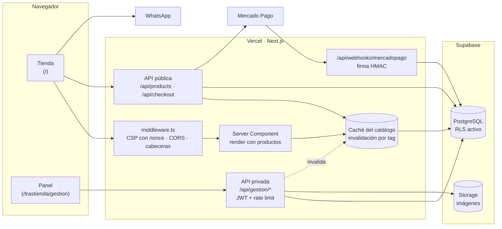
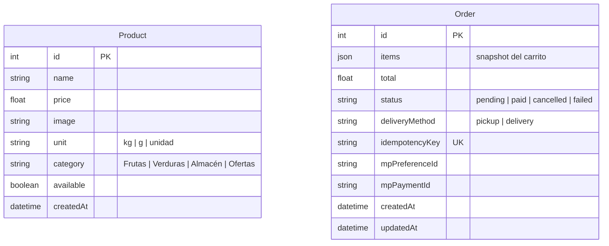

# El Pampa — Tienda online para una verdulería de barrio


**Sitio en producción:** [elpampa.vercel.app](https://elpampa.vercel.app)

Tienda online y panel de administración para **El Pampa**, una verdulería y frutería
real de Barrio General Paz, Córdoba (Argentina). Los clientes arman el pedido desde el
celular —por kilo, por gramo o por unidad—, eligen retiro o envío y pagan por
transferencia o con Mercado Pago. El dueño gestiona catálogo, stock y pedidos desde
un panel propio.

No es una maqueta: está en uso, con clientes y pedidos reales. Eso condicionó casi
todas las decisiones técnicas, y el foco de este README está justamente ahí: **qué
problema había y por qué se resolvió de esa forma**.

---

## Índice

- [El problema](#el-problema)
- [Funcionalidades](#funcionalidades)
- [Stack](#stack)
- [Arquitectura](#arquitectura)
- [Decisiones técnicas destacadas](#decisiones-técnicas-destacadas)
- [Modelo de datos](#modelo-de-datos)
- [API](#api)
- [Estructura del proyecto](#estructura-del-proyecto)
- [Correr el proyecto localmente](#correr-el-proyecto-localmente)
- [Variables de entorno](#variables-de-entorno)
- [Deploy](#deploy)
- [Limitaciones conocidas y próximos pasos](#limitaciones-conocidas-y-próximos-pasos)

---

## El problema

La verdulería tomaba pedidos solo por WhatsApp. Eso significaba:

- Mandar la lista de precios a mano cada vez que alguien preguntaba.
- Ir y volver con cada cliente para confirmar cantidades ("¿medio kilo o uno?").
- Calcular el total a mano, con errores.
- No tener registro de qué se vendió cada día.

El objetivo fue que el cliente pueda **armar y enviar el pedido solo**, con precios
actualizados y el total calculado, y que el dueño tenga **un lugar donde ver y
confirmar los pedidos** sin cambiar su forma de trabajar (siguen cerrando el pedido
por WhatsApp, pero ahora llega completo).

---

## Funcionalidades

### Para el cliente

- **Catálogo con búsqueda y filtro por categoría** (Frutas, Verduras, Almacén, Ofertas).
- **Cantidades por unidad de venta**: cada producto se vende por `kg`, `g` o `unidad`,
  con pasos adecuados (de a 250 g para lo que va por kilo, de a 100 g para lo que va por gramo).
- **Carrito en panel lateral** con cambio de unidad kg/g, ajuste de cantidades y
  productos sugeridos.
- **Indicador de disponibilidad** en cada producto; lo que no hay en stock baja al final
  de la lista y no se puede agregar.
- **Retiro o envío**, con pedido mínimo para envío y **envío gratis desde $20.000**
  (el carrito avisa cuánto falta para llegar).
- **Dos formas de pago**: transferencia (abre WhatsApp con el pedido ya redactado) o
  Mercado Pago Checkout Pro.
- **Estado del local en vivo** ("Abierto ahora" / "Cerrado ahora") según los horarios reales.
- **Menú de navegación fijo** tipo app para saltar a productos, ubicación o información.
- Mapa, horarios, preguntas frecuentes, términos y política de privacidad.

### Para el dueño (panel de administración)

- Alta, edición y baja de productos, con **subida de imágenes comprimidas a WebP en el
  navegador** antes de enviarlas (menos datos móviles y menos almacenamiento).
- **Botón de "sin stock" de un toque**, sin entrar a editar el producto.
- Búsqueda y orden de productos.
- Pedidos del día con navegación por fecha, y acciones para confirmar pago, cancelar o borrar.

---

## Stack

| Capa | Tecnología | Por qué |
|---|---|---|
| Framework | **Next.js 15** (App Router) + **React 19** | Frontend y API en un solo proyecto desplegable en Vercel, sin servidor aparte. |
| Lenguaje | **TypeScript** | Tipos compartidos entre API y componentes (`src/lib/types.ts`). |
| Base de datos | **PostgreSQL** en Supabase | Postgres administrado con plan gratuito suficiente para el volumen del negocio. |
| ORM | **Prisma 6** | Migraciones versionadas y consultas parametrizadas por defecto. |
| Archivos | **Supabase Storage** | Imágenes de productos, accedido por su API REST directamente. |
| Pagos | **Mercado Pago** Checkout Pro | Medio de pago dominante en Argentina. Integración por REST, sin SDK. |
| Auth | **JWT** (`jsonwebtoken`) | Un único administrador: no justificaba un proveedor de identidad. |
| Estilos | **CSS plano** con custom properties | Una sola hoja, paleta temática, sin dependencias de framework CSS. |
| Hosting | **Vercel** + Vercel Analytics | Deploy automático en cada push. |

---

## Arquitectura



**Una sola aplicación, dos superficies.** La tienda (`storefront-page.tsx`) y el panel
(`admin-panel-page.tsx`) son componentes cliente que usan `fetch` contra los route
handlers de Next. No hay servidor Express, ni librería de estado global, ni librería de
data fetching: para el tamaño del proyecto no aportaban nada que justificara la
dependencia.

La home es un **Server Component** que lee el catálogo y se lo pasa a la tienda como
estado inicial, de modo que el HTML ya llega con los productos (ver
[SEO y asistentes de IA](#4-seo-y-descubribilidad-por-asistentes-de-ia)).

---

## Decisiones técnicas destacadas

### 1. Seguridad por capas

El sitio maneja pedidos y datos de pago, así que se hizo una auditoría completa. Lo más
relevante que apareció y cómo se resolvió:

**La base de datos estaba abierta.** Supabase expone todas las tablas del schema
`public` por una API REST usando el rol `anon`, cuya clave está pensada para ser
pública. Ese rol tenía `SELECT/INSERT/UPDATE/DELETE/TRUNCATE` sobre todas las tablas y
la de productos tenía Row Level Security desactivado: con esa clave se podía borrar el
catálogo entero.

La migración [`enable_row_level_security`](prisma/migrations/20260811050000_enable_row_level_security/migration.sql)
activa RLS en todas las tablas **sin políticas** (denegar por defecto), revoca los
permisos de `anon` y `authenticated`, y cambia los privilegios por defecto para que
ninguna tabla futura nazca accesible. La aplicación no se ve afectada porque Prisma se
conecta como el rol dueño de las tablas, que no está sujeto a RLS.

Además:

| Capa | Implementación |
|---|---|
| **CSP** | `script-src` con **nonce por request** y `strict-dynamic`, sin `'unsafe-inline'`. Un script inyectado no tiene el nonce y el navegador lo bloquea. |
| **CORS** | La API rechaza con 403 cualquier llamada de navegador cuyo `Origin` no sea el propio sitio. |
| **Rate limiting** | Límites distintos por tipo de endpoint: login (8 intentos / 10 min), checkout, lecturas públicas, escrituras del panel, subidas y webhook. |
| **Validación en el servidor** | Nada se confía al frontend: precios, cantidades, unidades, categorías e ids se revalidan en cada endpoint. El total del pedido se calcula siempre con los precios de la base. |
| **Sanitización** | Se eliminan caracteres de control, bytes nulos, caracteres invisibles y overrides de dirección de texto; se normaliza y se acotan largos ([`sanitize.ts`](src/lib/sanitize.ts)). |
| **Inyección SQL** | No hay consultas SQL armadas a mano: todo pasa por Prisma, que parametriza. Verificado con payloads de inyección en ids, login y filtros. |
| **Autenticación** | JWT con algoritmo fijado a `HS256` (descarta tokens `alg: none`), validación de `issuer` y del claim `role`. Comparación de credenciales en tiempo constante. |
| **Uploads** | Solo WebP/JPG/PNG hasta 5 MB, con nombre generado en el servidor: no se puede forzar un `.html` o `.svg` en el bucket público. |
| **Webhook de pagos** | Verifica la firma HMAC de Mercado Pago y **consulta el pago contra su API** antes de tocar un pedido, en vez de confiar en el cuerpo del request. |
| **Errores** | Mensajes genéricos al cliente; el detalle queda en los logs del servidor. Un JSON mal formado devuelve 400, no 500. |
| **Auditoría** | Eventos sospechosos (logins fallidos, rate limits, tokens inválidos, orígenes bloqueados) se registran como JSON de una línea con la clave `secEvent`, filtrables en Vercel. Nunca se loguean contraseñas ni tokens. |

### 2. Checkout idempotente

**Problema:** cada envío del checkout creaba un pedido nuevo. En el celular, con una
conexión lenta, tocar "Pagar" dos veces generaba dos pedidos y dos links de pago.

**Solución, en tres barreras:**

1. El botón se deshabilita mientras el pedido está en curso.
2. El navegador genera una **clave de idempotencia** por intento de compra. Se mantiene
   si el cliente reintenta y se renueva recién cuando el pedido se registra bien.
3. La columna `idempotencyKey` tiene **índice único**. Si dos requests con la misma
   clave llegan a la vez y ambos pasan la verificación previa, la base rechaza el
   segundo insert (`P2002`) y el handler devuelve el pedido que ya se había creado.

Las dos primeras barreras se pueden saltear (dos pestañas, reintentos de red); la
tercera no, porque la garantía la da la base de datos. Un reintento devuelve el mismo
pedido y el **mismo link de pago**, sin generar preferencias duplicadas.

Verificado con 3 envíos seguidos y con 5 requests concurrentes con la misma clave: en
ambos casos, un único pedido.

La llamada a Mercado Pago queda **fuera de cualquier transacción** a propósito:
mantener una transacción abierta mientras se espera una API externa retiene locks todo
ese tiempo. Si la creación del link de pago falla, el pedido igual queda registrado y el
cliente puede pagar por transferencia.

### 3. Caché del catálogo con invalidación inmediata

**Problema:** la base está en São Paulo y la consulta del catálogo tardaba **~200 ms**.
Como la home se renderiza por request (lo exige la CSP con nonce), cada visita pagaba
esa latencia antes de mostrar nada.

**Solución:** la lectura del catálogo se cachea con `unstable_cache` y un tag. Cada
acción del panel que modifica productos (crear, editar, borrar, cambiar disponibilidad)
invalida ese tag, así que **un cambio de precio o de stock se ve al instante** y no
cuando vence la caché.

Resultado medido en local: **~200 ms → ~5 ms** por lectura. Como efecto secundario,
muchas visitas simultáneas se traducen en una sola consulta a la base.

### 4. SEO y descubribilidad por asistentes de IA

**Problema:** los productos se cargaban con `fetch` después de ejecutar JavaScript.
Google suele ejecutarlo, pero los crawlers de asistentes de IA en general no: para
ellos la tienda aparecía vacía.

**Solución:**

- La home pasó a **Server Component** y el HTML inicial ya incluye todo el catálogo.
- **Datos estructurados JSON-LD** con `GroceryStore` (dirección, coordenadas, horarios,
  zona de envío), `OfferCatalog` con cada producto, precio y disponibilidad
  (`InStock`/`OutOfStock`) y `FAQPage`.
- **[`/llms.txt`](https://elpampa.vercel.app/llms.txt)**: resumen del negocio en texto
  plano para modelos de lenguaje, generado a partir de los datos reales.
- `robots.txt` permite explícitamente a los crawlers de IA.
- Sección visible de preguntas frecuentes: contenido real para el usuario, no texto
  oculto para posicionar.

### 5. Mercado Pago con degradación controlada

La integración es **opcional**: si no hay token configurado, el selector de pago con
tarjeta no se muestra y el flujo de transferencia queda exactamente igual. Se integró
por REST con `fetch` (dos llamadas: crear preferencia y consultar pago) en lugar de
sumar el SDK.

Detalle no obvio: Mercado Pago exige cantidades enteras, pero acá se venden 0,75 kg.
Cada línea se envía como una unidad con el subtotal como precio, y la cantidad real
queda en el título que ve el cliente.

### 6. Pensado para el celular

La mayoría de los clientes entra desde el teléfono:

- Áreas táctiles de **44×44 px** (recomendación de Apple) en controles de cantidad,
  aplicadas solo en pantallas táctiles con `@media (pointer: coarse)` para no agrandar
  el diseño en escritorio.
- Barra de navegación fija que acompaña el scroll.
- Probado en anchos de 375, 768, 1280 y 1440 px sin scroll horizontal.
- Las animaciones respetan `prefers-reduced-motion`.

### 7. Rutas privadas no predecibles

El panel vive en `/trastienda` en lugar de `/admin` o `/login`, y no figura en
`robots.txt` (que es público y lo habría anunciado). **No se presenta como medida de
seguridad** —cualquiera puede verlo en el JavaScript—, sino como forma de quedar fuera
del barrido automático de bots. La protección real es el JWT, el rate limiting y la
contraseña.

---

## Modelo de datos



`Order.items` es un **snapshot en JSON** de los productos al momento de la compra, no
una relación con `Product`. Es intencional: si mañana cambia el precio del tomate o se
borra un producto, los pedidos históricos siguen mostrando lo que realmente se vendió y
a qué precio. Como consecuencia, listar pedidos no requiere consultas adicionales por
ítem (no hay problema N+1), y el checkout resuelve todo el carrito en una sola consulta
con `WHERE id IN (...)`.

Las 6 migraciones están versionadas en [`prisma/migrations`](prisma/migrations) e
incluyen comentarios con el porqué de cada cambio.

---

## API

### Pública

| Método | Ruta | Descripción |
|---|---|---|
| `GET` | `/api/products` | Catálogo (cacheado). Disponibles primero, luego alfabético. |
| `GET` | `/api/store-info` | Datos del local: horarios, envíos, medios de pago habilitados. |
| `POST` | `/api/checkout` | Registra el pedido. Idempotente. Opcionalmente genera link de Mercado Pago. |
| `POST` | `/api/webhooks/mercadopago` | Notificaciones de pago. Requiere firma HMAC válida. |

### Privada (`Authorization: Bearer <jwt>`)

| Método | Ruta | Descripción |
|---|---|---|
| `POST` | `/api/gestion/login` | Devuelve un JWT válido por 12 h. |
| `POST` | `/api/gestion/products` | Crea un producto. |
| `PUT` / `DELETE` | `/api/gestion/products/:id` | Edita o elimina un producto. |
| `PUT` | `/api/gestion/products/:id/availability` | Marca un producto como disponible o sin stock. |
| `POST` | `/api/gestion/upload-product-image` | Sube una imagen a Supabase Storage. |
| `GET` | `/api/gestion/orders?date=YYYY-MM-DD` | Pedidos de un día (hora de Argentina). |
| `PUT` | `/api/gestion/orders/:id/confirm` | Marca un pedido como pagado. |
| `PUT` | `/api/gestion/orders/:id/cancel` | Cancela un pedido pendiente. |
| `DELETE` | `/api/gestion/orders/:id` | Elimina un pedido. |

Todos los endpoints privados siguen el mismo patrón: verificación de token, rate limit,
validación del cuerpo y `try/catch` con log del error y respuesta genérica.

---

## Estructura del proyecto

```
src/
├── app/
│   ├── page.tsx                  # Home: Server Component, JSON-LD, preguntas frecuentes
│   ├── layout.tsx                # Metadata global
│   ├── globals.css               # Estilos (paleta con custom properties)
│   ├── trastienda/               # Ingreso y panel de administración
│   ├── api/
│   │   ├── products/             # Catálogo público
│   │   ├── checkout/             # Registro de pedidos
│   │   ├── store-info/
│   │   ├── webhooks/mercadopago/
│   │   └── gestion/              # API privada del panel
│   ├── llms.txt/  robots.ts  sitemap.ts  opengraph-image.tsx
│   └── terminos/  privacidad/  success/  failure/  pending/
├── components/
│   ├── storefront-page.tsx       # Tienda
│   ├── admin-panel-page.tsx      # Panel
│   └── login-page.tsx
├── lib/
│   ├── auth.ts                   # JWT y comparación en tiempo constante
│   ├── products.ts               # Catálogo cacheado + invalidación
│   ├── mercadopago.ts            # Preferencias y verificación de webhooks
│   ├── rate-limit.ts             # Limitador por IP con presets por endpoint
│   ├── sanitize.ts  validation.ts  request-body.ts  route-params.ts
│   ├── security-log.ts           # Eventos de seguridad en JSON
│   ├── product-units.ts          # Unidades, pasos y redondeo de cantidades
│   ├── site.ts                   # Configuración del negocio desde variables de entorno
│   └── routes.ts  store-hours.ts  format-price.ts  types.ts
└── middleware.ts                 # CSP con nonce, CORS y cabeceras de seguridad
prisma/
├── schema.prisma
└── migrations/                   # 6 migraciones comentadas
scripts/                          # Utilidades de mantenimiento de datos
```

---

## Correr el proyecto localmente

**Requisitos:** Node.js 20 o superior y una base PostgreSQL (un proyecto gratuito de
Supabase alcanza).

```bash
git clone <url-del-repositorio>
cd verduleria-web
npm install
cp .env.example .env        # completar con tus valores (ver tabla abajo)
npx prisma migrate deploy   # crea las tablas
node prisma/seed.js         # opcional: carga 3 productos de ejemplo
npm run dev
```

- Tienda: http://localhost:3000
- Panel: http://localhost:3000/trastienda (usuario y contraseña de `ADMIN_USERNAME` / `ADMIN_PASSWORD`)

Otros comandos:

```bash
npm run build     # prisma generate + next build
npm run start     # sirve la build de producción
```

> **Recomendación:** usá una base de datos separada para desarrollo. Si `.env` apunta a
> la base de producción, cualquier prueba local crea pedidos reales.

---

## Variables de entorno

| Variable | Obligatoria | Descripción |
|---|:---:|---|
| `DATABASE_URL` | Sí | Conexión a Postgres. En Supabase, pooler en modo *transaction*. |
| `DIRECT_URL` | Sí | Conexión para migraciones. En Supabase, pooler en modo *session*. |
| `ADMIN_USERNAME` / `ADMIN_PASSWORD` | Sí | Credenciales del panel. |
| `JWT_SECRET` | Sí | Secreto para firmar tokens. Mínimo recomendado: 32 caracteres aleatorios. |
| `SUPABASE_URL` / `SUPABASE_SERVICE_ROLE_KEY` | Para imágenes | Subida de imágenes a Storage. La service role key nunca sale del servidor. |
| `SUPABASE_STORAGE_BUCKET` | No | Nombre del bucket (por defecto `product-images`). |
| `SITE_URL` | No | URL canónica para metadata, sitemap y Mercado Pago. |
| `STORE_NAME`, `STORE_ADDRESS`, `STORE_NEIGHBORHOOD` | No | Datos del negocio. |
| `STORE_WEEKDAY_HOURS`, `STORE_SUNDAY_HOURS` | No | Texto de horarios. |
| `TRANSFER_ALIAS`, `TRANSFER_CBU`, `WHATSAPP_NUMBER` | No | Datos para cobrar por transferencia. |
| `DELIVERY_PROVIDER_NAME`, `DELIVERY_MAX_WEIGHT_KG` | No | Datos del servicio de envío. |
| `DELIVERY_MIN_PURCHASE` | No | Pedido mínimo para envío (por defecto 10000). |
| `DELIVERY_FREE_THRESHOLD` | No | Monto desde el que el envío es gratis (por defecto 20000). |
| `MP_ACCESS_TOKEN`, `MP_WEBHOOK_SECRET` | No | Activan Mercado Pago. Sin ellas, solo transferencia. |
| `INSTAGRAM_URL` | No | Si está vacía, el menú no muestra Instagram. |

Ninguna variable usa el prefijo `NEXT_PUBLIC_`: todos los valores se leen en el
servidor y ningún secreto llega al bundle del navegador. El archivo `.env` está excluido
del repositorio.

---

## Deploy

El proyecto está desplegado en **Vercel** con deploy automático en cada push a `main`.

1. Importar el repositorio en Vercel (preset **Next.js**, comandos por defecto).
2. Cargar las variables de entorno de la tabla anterior.
3. Aplicar las migraciones contra la base de producción: `npm run prisma:deploy`.

### Mercado Pago (opcional)

1. Crear una aplicación en el [panel de desarrolladores](https://www.mercadopago.com.ar/developers/panel/app)
   y copiar el Access Token a `MP_ACCESS_TOKEN`.
2. En **Webhooks → Configurar notificaciones**, registrar
   `https://<tu-dominio>/api/webhooks/mercadopago` con el evento **Pagos**.
3. Copiar la clave secreta a `MP_WEBHOOK_SECRET`.

### Monitoreo

En **Vercel → Logs**, filtrar por `secEvent` para ver intentos de login fallidos, rate
limits alcanzados y otros eventos de seguridad.

---

## Limitaciones conocidas y próximos pasos

Decisiones tomadas conscientemente, con su costo:

- **Rate limiting en memoria.** En Vercel cada instancia serverless tiene su propia
  memoria, así que el límite no es global. Frena la fuerza bruta contra el login, pero
  para protección distribuida el siguiente paso es Vercel Firewall o Upstash Redis.
- **Render dinámico en todas las páginas.** La CSP con nonce requiere un valor distinto
  por respuesta, lo que impide el prerenderizado estático. Se compensa con la caché del
  catálogo; la alternativa sería una CSP más débil con `'unsafe-inline'`.
- **Token del panel en `localStorage`.** Es vulnerable si hubiera XSS; la CSP estricta
  mitiga ese riesgo. El paso siguiente sería una cookie `httpOnly`.
- **Sin tests automatizados.** La verificación se hizo con pruebas manuales y scripts
  contra la API (validación, inyección, concurrencia, idempotencia). Sumar tests de
  integración para checkout y webhook es la próxima prioridad.
- **Un solo administrador.** El modelo de auth no contempla múltiples usuarios ni roles.

---

## Autor

**Joaquín Morales** — diseño, desarrollo y puesta en producción.
